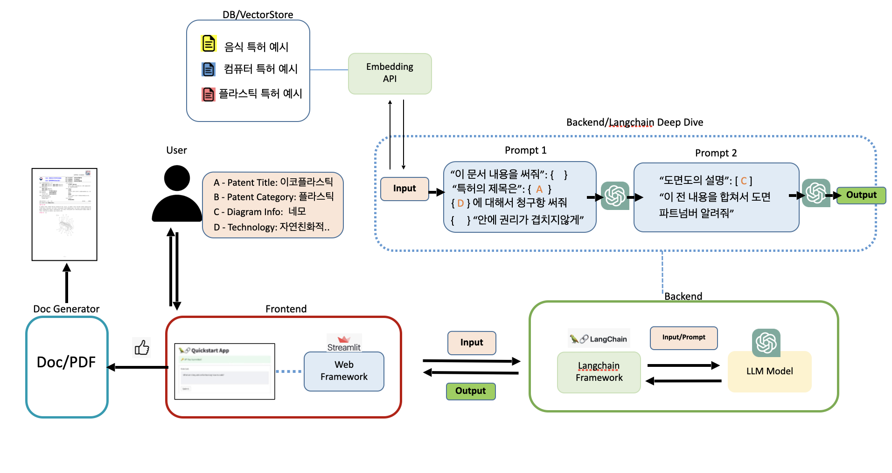

 
## Installation

To set up the development environment and install all the necessary dependencies, follow these steps:

1. **Clone the Repository:**
   ```bash
   git clone https://github.com/your-username/your-repo-name.git

pip install -r requirements.txt
